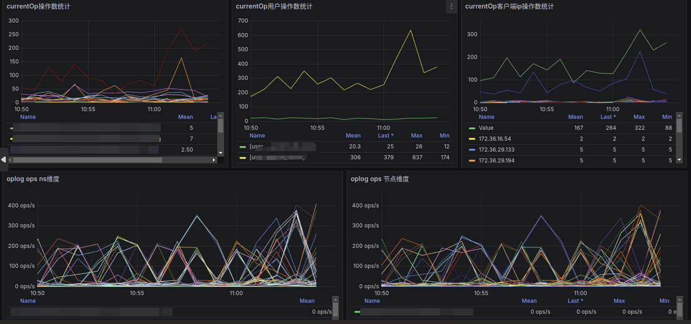
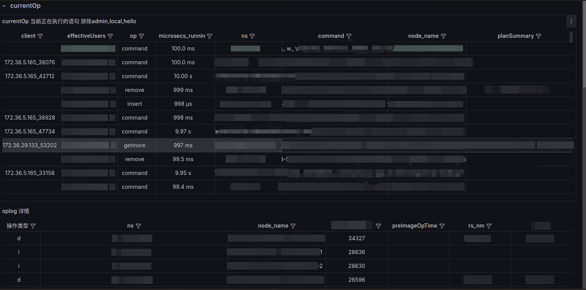
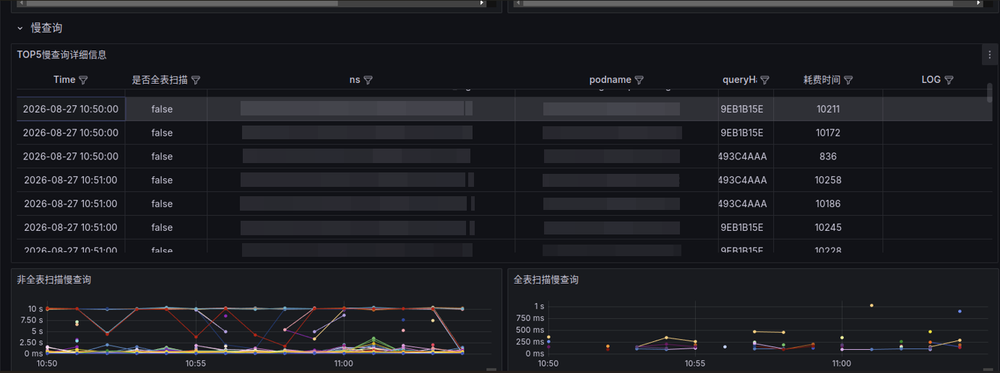

# Grafana 面板示例

基于 `mongo-oplog-exporter` 暴露的 Prometheus 指标搭建的 Grafana 监控面板，涵盖 **currentOp**、**oplog** 与 **慢查询** 三类视图。

## 预览

### currentOp 与 oplog 明细表

实时查看当前执行语句与 oplog 写入详情（命名空间、用户、客户端、执行计划等）。



### currentOp 与 oplog 统计图

按命名空间、用户、客户端 IP 统计 currentOp 操作数；按 ns / 节点维度展示 oplog 写入速率。



### 慢查询

TOP5 慢查询明细，以及全表扫描 / 非全表扫描慢查询时序图。



## 导入面板

1. 在 Grafana 中选择 **Dashboards → Import**。
2. 上传 [`mongo-currentop-oplog-slowquery.json`](./mongo-currentop-oplog-slowquery.json)。
3. 选择环境中的 **Prometheus** 数据源。
4. （可选）在面板变量中配置 `LogUrl`、`LogIndex`，用于慢查询表格跳转日志平台。

## 指标依赖

| 面板区域 | 主要指标 | 来源 |
|----------|----------|------|
| currentOp | `log_to_metric_mongo_currentop` | mongo-oplog-exporter |
| oplog | `log_to_metric_mongo_oplog` | mongo-oplog-exporter |
| 慢查询 | `log_to_metric_mongo_slowlog_gauge` | 需额外的 MongoDB 慢日志采集组件 |
| 变量 `replset` / `node_name` | `mongodb_up` | 通常来自 [mongodb_exporter](https://github.com/percona/mongodb_exporter) |

慢查询相关面板依赖独立的慢日志指标；若环境中未部署对应采集器，可删除或禁用「慢查询」分组下的面板。

## 过滤提示

exporter 默认 **不**过滤 currentOp 中的系统操作（`admin.$cmd` 等也会出现）。面板标题里的「排除 admin, local, hello」表示 Grafana 侧展示意图，或你在生产环境按推荐配置了 `CURRENTOP_IGNORE_KEYVALUE` 之后的效果。说明见 [README — 提示：过滤系统噪声](../../README.md#tip-filter-system-noise-in-production)（中文：[README.zh-CN](../../README.zh-CN.md#提示生产环境建议过滤系统噪声)）。

## 隐私说明

面板 JSON 与截图均已脱敏：不含真实 MongoDB 实例名、内网 IP、密码或日志平台 ID。导入后变量由当前环境的 Prometheus 动态填充；`LogUrl` / `LogIndex` 默认为空，按需自行配置。

## 文件说明

```
docs/grafana/
├── README.md                              # 本说明
├── mongo-currentop-oplog-slowquery.json   # 可导入的 Grafana 面板 JSON
└── images/
    ├── 01-currentop-oplog-tables.png
    ├── 02-currentop-oplog-stats.png
    └── 03-slowquery.png
```
